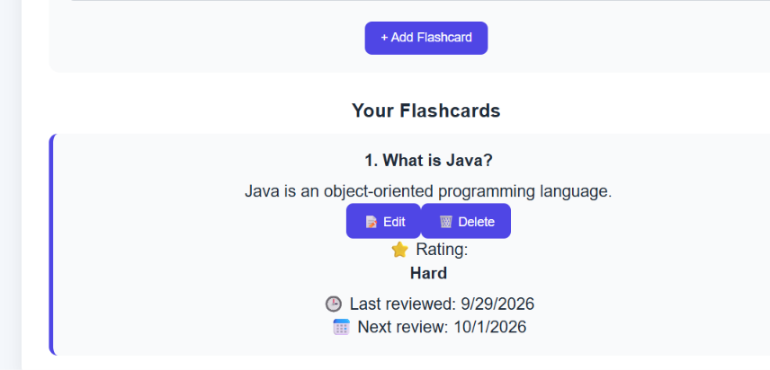

# 📚 Digital Flashcards

A full-stack digital flashcard application designed to help users learn efficiently using spaced repetition.

## 🚀 Features

- Create and manage flashcard decks
- Add, edit, and delete flashcards
- Study flashcards in an interactive study mode
- Reveal answers by clicking the card
- Rate cards as:
  - ❌ Again
  - 😐 Hard
  - 🙂 Good
  - 😎 Easy
- Automatic next-review date calculation
- Track last reviewed date
- Dashboard with learning statistics
- Persistent data storage using MongoDB
- REST API using Node.js and Express.js

## 🛠️ Tech Stack

### Frontend
- React.js
- JavaScript
- HTML
- CSS
- Vite

### Backend
- Node.js
- Express.js
- REST API

### Database
- MongoDB
- Mongoose

## 🔄 Spaced Repetition

The application calculates the next review date based on the user's rating:

| Rating | Next Review |
|---|---|
| Again | 1 day |
| Hard | 2 days |
| Good | 4 days |
| Easy | 7 days |

This helps users review difficult cards more frequently while allowing easier cards to be reviewed later.

## 📂 Project Structure

```text
digital-flashcards/
│
├── backend/
│   ├── models/
│   │   └── Deck.js
│   ├── server.js
│   ├── package.json
│   └── .env
│
├── frontend/
│   ├── src/
│   │   ├── App.jsx
│   │   ├── App.css
│   │   └── main.jsx
│   ├── package.json
│   └── vite.config.js
│
└── README.md
## 📸 Screenshots

### Dashboard


### Flashcard Review

